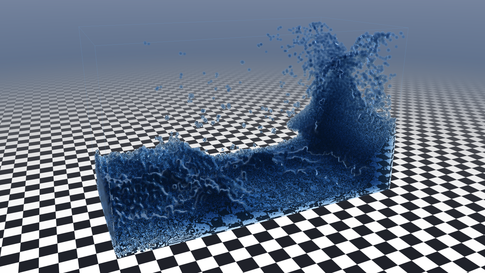
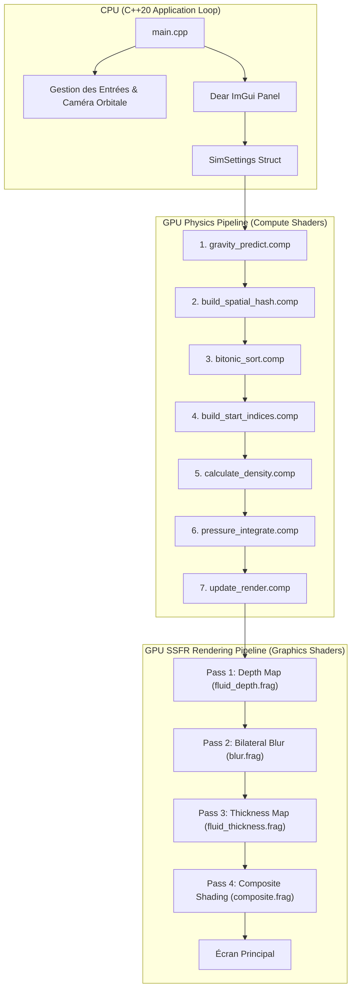
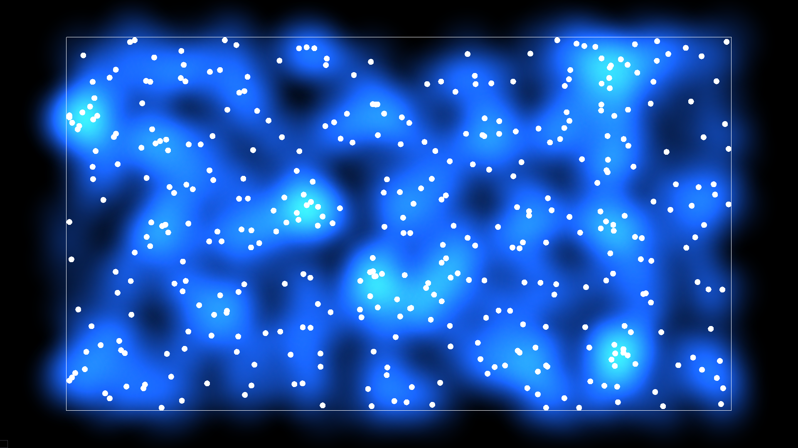
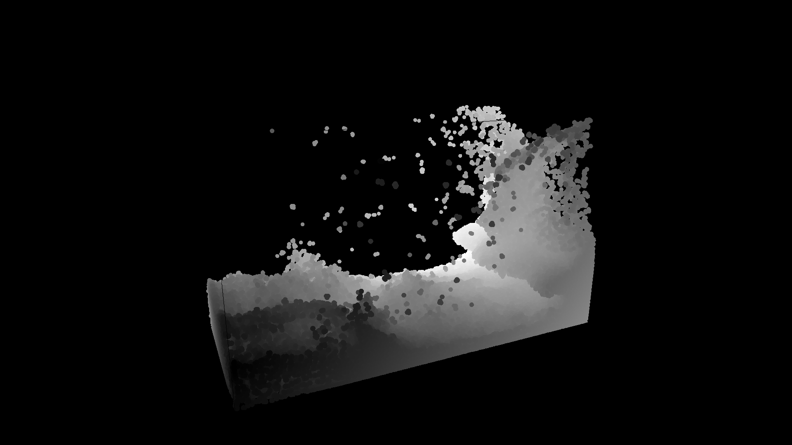
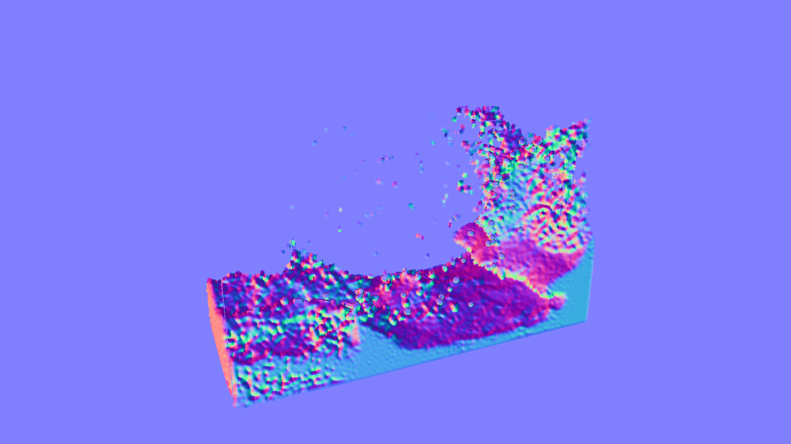
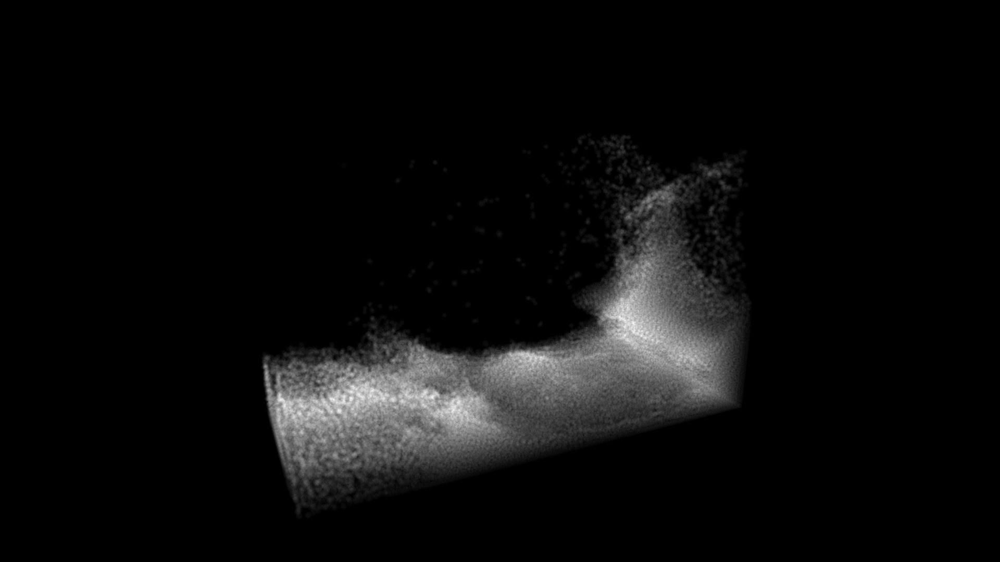
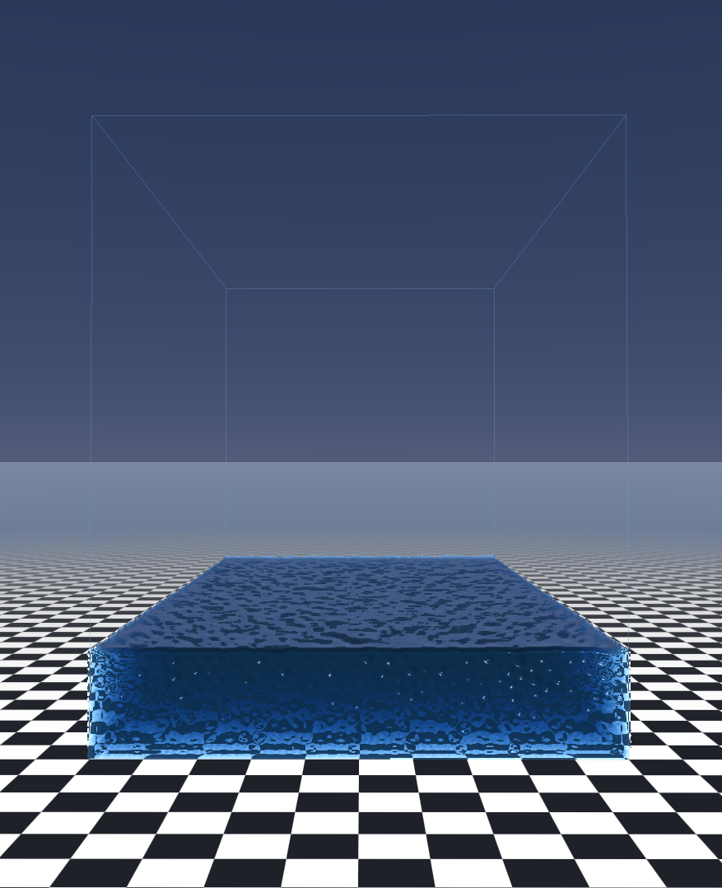
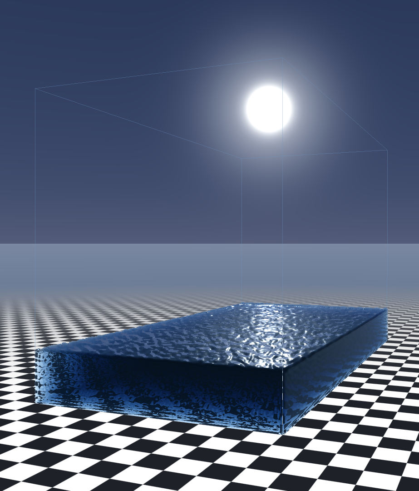

# 🌊 Real-Time OpenGL 3D SPH Water Simulation — Portfolio Report




---

## 📌 Présentation du Projet

Ce projet est un moteur de **simulation de fluide 3D en temps réel** développé en **C++20** et **OpenGL 4.6 Core Profile**. Il combine deux piliers majeurs de l'informatique graphique et de la simulation physique moderne :

1. **Simulation physique particulaire GPU (SPH - Smoothed Particle Hydrodynamics)** : calculée entièrement en parallèle via des **Compute Shaders**, accélérée par une grille de **Hachage Spatial 3D** et un algorithme de **Tri Bitonic GPU** en $O(N \log^2 N)$.
2. **Rendu de surface fluide en espace écran (SSFR - Screen-Space Fluid Rendering)** : un pipeline de rendu multi-passes générant une surface continue d'eau à partir d'un nuage de points, incorporant un **filtrage bilatéral préservant les contours**, la **reconstruction de normales 3D**, la **réfraction optique (Loi de Beer-Lambert)** et des **réflexions de Fresnel (SSR + ciel procédural)**.

L'application permet d'interagir en temps réel avec jusqu'à **75 000+ particules à 60 FPS**, avec un contrôle total sur les paramètres physiques et visuels via une interface intégrée **Dear ImGui**.


---

## 🛠️ Architecture Globale & Design Orienté Données

La conception du moteur repose sur le paradigme **Data-Oriented Design (DOD)** pour maximiser le débit mémoire du GPU et annuler tout goulot d'étranglement CPU-GPU.



### Allocation & Mémoire GPU (SSBOs)

Toutes les données des particules résident dans la mémoire VRAM sous forme de **Shader Storage Buffer Objects (SSBOs)** configurés avec l'alignement `std430` :

| SSBO Buffer          | Format / Type | Description                                                                         |
| :------------------- | :------------ | :---------------------------------------------------------------------------------- |
| `positionBuffer`     | `vec4[]`      | Positions actuelles $(x, y, z, 0)$ des particules dans l'espace monde.              |
| `velocityBuffer`     | `vec4[]`      | Vecteurs vitesse $(v_x, v_y, v_z, 0)$ de chaque particule.                          |
| `predictedPosBuffer` | `vec4[]`      | Positions prédites pour l'intégration de densité et de pression.                    |
| `densityBuffer`      | `float[]`     | Densité locale $\rho_i$ calculée autour de chaque particule.                        |
| `nearDensityBuffer`  | `float[]`     | Densité à courte portée $\rho_{near, i}$ (évite le regroupement excessif).          |
| `spatialHashBuffer`  | `uvec2[]`     | Clés de hachage spatial et IDs originaux des particules `(particleIndex, cellKey)`. |
| `startIndicesBuffer` | `uint[]`      | Table d'indexation pour la recherche de voisins en $O(1)$.                          |
| `renderBuffer`       | `vec4[]`      | Buffer VBO pour le rendu : position $(x, y, z)$ et rayon $r$.                       |

---

## 🧮 1. Simulation Physique SPH sur GPU

La méthode **Smoothed Particle Hydrodynamics (SPH)** est une formulation lagrangienne des équations de Navier-Stokes. Un fluide est représenté par un ensemble de particules discrètes interagissant entre elles via des **noyaux de lissage (Smoothing Kernels)**.

### Formulations Mathématiques

#### 1. Estimation de la Densité ($\rho_i$)

La densité au niveau d'une particule $i$ est calculée par la somme des contributions de ses voisines $j$ situées à une distance inférieure au rayon de lissage $h$ :

$$\rho_i = \sum_{j} W_{spiky2}(\|\mathbf{r}_i - \mathbf{r}_j\|, h)$$

Où le noyau **Spiky Power 2** est défini par :

$$W_{spiky2}(d, h) = \frac{15}{2 \pi h^5} (h - d)^2 \quad \text{pour } 0 \le d \le h$$

Une densité secondaire à très courte portée (**Near Density**) $\rho_{near, i}$ est également évaluée avec un noyau **Spiky Power 3** pour repousser fortement les particules trop proches :

$$W_{spiky3}(d, h) = \frac{15}{\pi h^6} (h - d)^3 \quad \text{pour } 0 \le d \le h$$

#### 2. Calcul de Pression ($P_i$)

La pression est déterminée à partir de la densité cible $\rho_0$ et du multiplicateur de rigidité $k$ :

$$P_i = k \cdot (\rho_i - \rho_0)$$

$$P_{near, i} = k_{near} \cdot \rho_{near, i}$$

#### 3. Intégration des Forces (Pression & Viscosité)

La force de pression partagée entre deux particules $i$ et $j$ s'exprime de manière symétrique pour respecter le troisième principe de Newton :

$$\mathbf{F}_{pression, i} = -\sum_{j} \frac{P_i + P_j}{2 \rho_j} \nabla W_{spiky2}(\|\mathbf{r}_{ij}\|, h) \cdot \hat{\mathbf{r}}_{ij}$$

$$\mathbf{F}_{viscosité, i} = \mu \sum_{j} (\mathbf{v}_j - \mathbf{v}_i) \cdot W_{poly6}(\|\mathbf{r}_{ij}\|, h)$$


_Visualisation des cartes de densité SPH et du comportement du noyau de lissage sur les particules._

---

### Accélération Spatiale & Tri Bitonic GPU

Pour rechercher les particules voisines en $O(1)$ au lieu de $O(N^2)$, le domaine 3D est subdivisé en une grille régulière où chaque cellule a pour taille le rayon de lissage $h$.

1. **Hachage Spatial 3D (`build_spatial_hash.comp`)** :
   Chaque particule calcule son identifiant de cellule 3D $\mathbf{C} = \lfloor \mathbf{P} / h \rfloor$ et génère un hash unique :
   $$\text{hash}(\mathbf{C}) = (C_x \cdot 15823 + C_y \cdot 9737333 + C_z \cdot 440817757) \pmod N$$

2. **Tri Bitonic GPU (`bitonic_sort.comp`)** :
   Les paires `(particleIndex, cellKey)` sont triées en parallèle sur GPU en $O(\log^2 N)$ étapes de comparaison-échange. Les particules appartenant à la même cellule se retrouvent ainsi contiguës en mémoire.

3. **Table des Indices de Début (`build_start_indices.comp`)** :
   Une passe rapide identifie le premier index de chaque cellule dans le tableau trié. Lors des calculs de densité et de pression, chaque particule explore uniquement les 27 cellules 3D adjacentes.

---

### 🎥 Démonstrations Animées de la Physique

#### Intégration de la Pression & Incompressibilité


_Démonstration animée du calcul de pression SPH garantissant l'incompressibilité du fluide sous contrainte._

#### Gravité, Vent & Collisions avec la Boîte


_Démonstration de la dynamique des fluides soumis aux forces de gravité, aux forces de vent et aux collisions élastiques._

#### Validation & Évolution du Solveur (du 2D au 3D)


_Prototypage initial et validation des algorithmes SPH sur un domaine 2D._


_Transition et généralisation du solveur physique particulaire du domaine 2D au domaine 3D complet._

---

## 🎨 2. Pipeline Screen-Space Fluid Rendering (SSFR)

Rendre des particules sous forme de simples sphères donne un aspect métaball déconnecté. Le **Screen-Space Fluid Rendering** transforme ce nuage de points en une surface liquide continue et réaliste au travers de 5 passes de shaders dédiées.

```
[Positions Particules] ──> Pass 1: Depth Map (R32F) ──> Pass 2: Bilateral Blur (R32F)
                                                                 │
[Scene Background Color] ──> Pass 4: Composite Shading <─────────┼── Pass 3: Thickness Map (R32F)
                                  │ (Fresnel, SSR, Refraction)
                                  ▼
                            [Écran Final]
```

---

### Passe 1 : Génération de la Carte de Profondeur Initiale (`fluid_depth.frag`)

Les particules sont émises sous forme de **Point Sprites** dans le shader de sommet (`fluid_particle.vert`). Dans `fluid_depth.frag`, chaque point est projeté en sphère 3D. Les fragments en dehors du rayon de la sphère sont rejetés (`discard`), et la profondeur exacte en vue caméra ($z_{eye}$) est calculée et stockée dans une texture `GL_R32F`.


_Carte de profondeur brute des particules. Chaque sphère est distincte et les discontinuités de profondeur sont visibles._

---

### Passe 2 : Lissage par Filtre Bilatéral Adaptatif (`blur.frag`)

Pour transformer ces sphères individuelles en une nappe d'eau fluide sans flouter les bords de la surface contre l'arrière-plan, un **filtre bilatéral séparable en deux passes (horizontale et verticale)** est appliqué sur la carte de profondeur.

Le filtre pondère les échantillons par leur distance spatiale et leur différence de profondeur :

$$W(i, j) = \exp\left(-\frac{\|\mathbf{x}_i - \mathbf{x}_j\|^2}{2 \sigma_s^2}\right) \cdot \exp\left(-\frac{|z_i - z_j|^2}{2 \sigma_r^2}\right)$$


_Carte de profondeur lissée. La surface de l'eau devient continue tout en conservant des arêtes nettes aux frontières de la silhouette._

---

### Passe 3 : Reconstruction des Normales en Espace Écran (`composite.frag`)

À partir de la profondeur lissée $z(u, v)$, la position 3D dans l'espace vue $\mathbf{P}(u, v)$ est reconstruite pour chaque pixel. Les dérivées partielles horizontales $\frac{\partial \mathbf{P}}{\partial x}$ et verticales $\frac{\partial \mathbf{P}}{\partial y}$ permettent de calculer le champ de normales de la surface par produit vectoriel :

$$\mathbf{N} = \text{normalize}\left( \frac{\partial \mathbf{P}}{\partial x} \times \frac{\partial \mathbf{P}}{\partial y} \right)$$


_Champ de normales 3D reconstruit en espace écran. Révèle la topologie fine de la surface de l'eau._

---

### Passe 4 : Accumulation d'Épaisseur & Absorption Optique (`fluid_thickness.frag`)

L'épaisseur de l'eau traversée par le rayon lumineux est accumulée par **Blend Additif (`GL_ONE`, `GL_ONE`)** dans une texture `GL_R32F` séparée.

Dans le shader de composition final, l'atténuation de la lumière suit la **Loi de Beer-Lambert** :

$$I_{réfracté} = I_{scène} \cdot \exp\left(-\text{épaisseur} \cdot \alpha \cdot (1 - \mathbf{C}_{eau})\right)$$

Où $\alpha$ est le coefficient d'absorption et $\mathbf{C}_{eau}$ la couleur de base de l'eau.


_Carte d'épaisseur de la masse d'eau accumulée. Les zones les plus sombres/épaisses absorbent davantage la lumière._

---

### Passe 5 : Composition Finale, Réfraction & Réflexions (`composite.frag`)

La passe finale combine tous les buffers pour produire le rendu réaliste :

1. **Réfraction avec Distorsion UV** :
   La scène d'arrière-plan est échantillonnée avec un décalage d'UV proportionnel à la normale de la surface :
   $$\text{UV}_{réfracté} = \text{UV} + \mathbf{N}_{xy} \cdot s_{réfraction}$$

2. **Réflexions de Fresnel (Schlick)** :
   Le facteur de réflexion varie selon l'angle d'incidence de la vue $\theta$ :
   $$F(\theta) = R_0 + (1 - R_0) (1 - \cos\theta)^p$$

3. **Ciel Procédural & Spéculaire** :
   Mélange entre la réfraction absorbée et la réflexion du ciel/soleil selon le coefficient de Fresnel.


_Résultat composite final : réflexion de Fresnel, réfraction déformée de la scène, absorption chromatique et brillance spéculaire._


_Visualisation détaillée des réflexions spéculaires du soleil et des vaguelettes de surface sur le liquide._

---

## 🎛️ Contrôles Interactifs & Interface ImGui

L'application intègre **Dear ImGui** pour permettre un ajustement dynamique de tous les paramètres physiques et visuels au cours de l'exécution :

```
┌────────────────────────────────────────────────────────┐
│ 🎛️ Simulation Controls                                │
├────────────────────────────────────────────────────────┤
│ [Pause / Resume]  [Reset Particles]                     │
│ Particle Count:   [===|=======] 75,000                 │
│ Gravity Y:        [======|====] -9.81 m/s²             │
│ Stiffness (k):    [====|======] 210.0                  │
│ Viscosity (μ):    [==|────────] 0.05                   │
├────────────────────────────────────────────────────────┤
│ 💧 Water Appearance                                    │
├────────────────────────────────────────────────────────┤
│ Water Color:      [ 🟦 #1A66A6 ]                       │
│ Absorption:       [====|======] 1.80                   │
│ Fresnel Power:    [======|====] 4.0                    │
│ Refraction Scale: [==|────────] 0.10                   │
│ Blur Radius:      [=====|─────] 10.0 px                │
└────────────────────────────────────────────────────────┘
```

| Contrôle                  | Action                                                                     |
| :------------------------ | :------------------------------------------------------------------------- |
| **Clic Gauche + Glisser** | Rotation de la caméra orbitale 360° autour du centre du bassin.            |
| **Molette Souris**        | Zoom avant / arrière fluide.                                               |
| **Interface ImGui**       | Ajustement en direct de la physique, des couleurs et des options de rendu. |

---

## ⚡ Performances & Optimisations GPU

- **Taille de Workgroup Compute** : Fixée à 256 threads par groupe de travail (`local_size_x = 256`), optimisée pour l'occupation des Compute Units (NVIDIA Warps / AMD Wavefronts).
- **Barrières Mémoire GPU (`glMemoryBarrier`)** : Synchronisation explicite `GL_SHADER_STORAGE_BARRIER_BIT` et `GL_VERTEX_ATTRIB_ARRAY_BARRIER_BIT` garantissant l'intégrité des données entre les passes de calcul et de rendu.
- **Framebuffers Redimensionnables** : Les FBOs s'adaptent instantanément aux redimensionnements de fenêtre sans fuite mémoire ni réallocation inutile.

---

## 🚀 Compilation & Exécution

### Prérequis

- Compilateur compatible **C++20** (GCC 10+, Clang 11+, MSVC 2019+)
- **CMake 3.20+**
- Carte graphique compatible **OpenGL 4.6** (Compute Shaders requis)

### Compilation sur Linux / macOS

```bash
git clone https://github.com/your-username/OpenGL-Water-Simulation.git
cd OpenGL-Water-Simulation
cmake -B build -DCMAKE_BUILD_TYPE=Release
cmake --build build --config Release -j$(nproc)
./build/OpenGL-Water-Simulation
```

### Compilation sur Windows (Visual Studio)

```cmd
cmake -B build -G "Visual Studio 17 2022" -A x64
cmake --build build --config Release
.\build\Release\OpenGL-Water-Simulation.exe
```

---

## 📚 Références & Remerciements

- **Physique SPH & Hachage Spatial 3D** : Inspiré des travaux de [Sebastian Lague — Fluid-Sim](https://github.com/SebLague/Fluid-Sim).
- **Techniques de Screen-Space Fluid Rendering** : W-J. van der Laan, M. Green, et M. Sainz (_Screen-Space Fluid Rendering with Curvature Flow_, GPU Gems / I3D).
- **Tutoriels OpenGL Core & Compute Shaders** : [LearnOpenGL.com](https://learnopengl.com/).

---

_Document réalisé pour la présentation du projet en Portfolio d'Ingénierie Graphique & Simulation._
